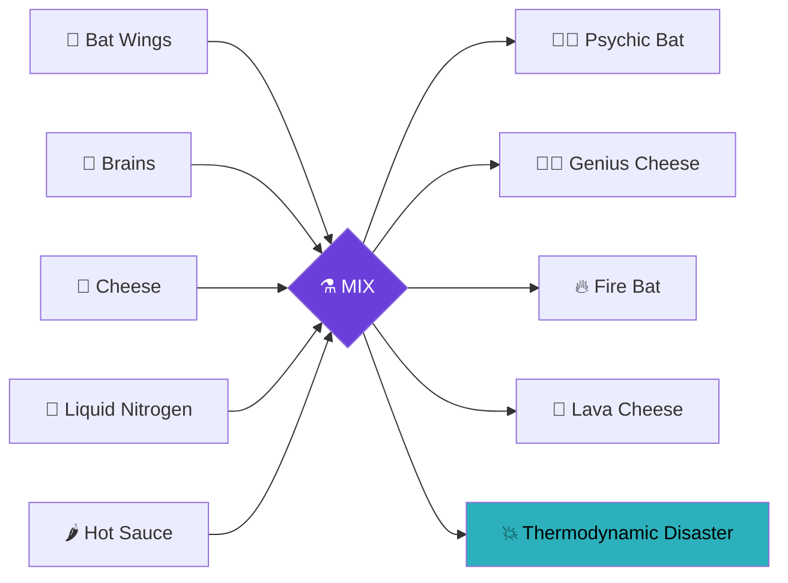
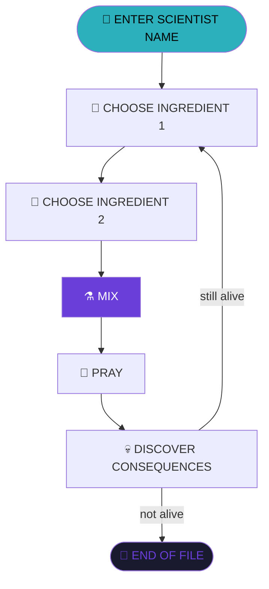

<div align="center">


[](https://git.io/typing-svg)


<br>


<sub><i>subject photograph, recovered from the lab's front desk</i></sub>

</div>

<div align="center">

```
╔══════════════════════════════════════════════════════════╗
║  ACCESS LOG — UNAUTHORIZED TERMINAL SESSION DETECTED       ║
║  LOCATION: SUB-LEVEL ??  |  STATUS: DO NOT ENTER            ║
║  ⚠ THIS FILE SHOULD NOT EXIST                               ║
╚══════════════════════════════════════════════════════════╝
```

</div>

---

## 🗂️ FILE 001 — INITIAL BRIEFING

> ⚠️ **WARNING:** This experiment has absolutely no scientific supervision.

You are an unhinged scientist locked in a lab with five substances of unknown origin:

<div align="center">

| Specimen | Codename | Threat Level |
|:---:|:---:|:---:|
| 🦇 | Bat Wings | 🟣🟣 |
| 🧠 | Human Brains | 🟣🟣🟣 |
| 🧀 | Cheese | 🟢 |
| 🧊 | Liquid Nitrogen | 🔵🔵 |
| 🌶️ | Hot Sauce | 🔴🔴🔴 |

</div>

And somehow... you were given clearance to mix them.

<div align="center">

    

<sub>specimen sketches, filed by an intern who was later reassigned</sub>

</div>

<table align="center">
<tr><td><b>Why?</b></td><td>Nobody knows.</td></tr>
<tr><td><b>Should you?</b></td><td>Absolutely not.</td></tr>
<tr><td><b>Will you anyway?</b></td><td>Obviously. 💀</td></tr>
</table>

<div align="center">

</div>

---

## 🧬 FILE 002 — SUBJECT OVERVIEW

**Mad Scientist** is a chaotic, text-based Python experiment simulator where you combine completely questionable ingredients and discover what happens.



Some combinations might create:

🦇🧠 **A Psychic Bat**
🧀 **Genius Cheese**
🔥 **A Fire Bat**
🌋 **Lava Cheese**
💥 **A Thermodynamic Disaster**

<div align="center">


<sub><i>containment photo — result of specimen 001 × specimen 005</i></sub>

</div>

And yes — you can run experiment after experiment until you finally decide that destroying science is enough.

---

## ⚗️ FILE 003 — EXPERIMENT PROTOCOL

<div align="center">



</div>

<details open>
<summary><b>📼 TERMINAL PLAYBACK — SESSION #0001</b></summary>

```text
> INITIATING EXPERIMENT SEQUENCE...

Choose your FIRST ingredient (1-5): 1

Choose your SECOND ingredient (1-5): 5

⚗️ Mixing the ingredients...
   [████████████████████] 100%

🧪 EXPERIMENT RESULT:

🔥 FIRE BAT!

The bat catches fire and starts flying
around your laboratory.

🔥 LABORATORY FIRE!

RUN!!!

> SESSION TERMINATED.
```

</details>

---

## 💀 FILE 004 — REDACTED QUERIES

<div align="center">

```
█████████████████████████████████████
█  QUESTIONS THE LAB WILL NOT ANSWER █
█████████████████████████████████████
```

</div>

What happens if you combine:

- 🧠 + 🧠 ?
- 🧀 + 🧀 ?
- 🌶️ + 🌶️ ?
- 🦇 + 🦇 ?

There may be answers.
There may also be consequences.

> I recommend finding out. 🔦

---

## 🛠️ FILE 005 — EQUIPMENT MANIFEST

<div align="center">


-console_output-6A3FD9?style=flat-square&labelColor=1a1a2e)
-user_interaction-2CB1BC?style=flat-square&labelColor=1a1a2e)


</div>

No fancy libraries. No frameworks.
Just Python and terrible scientific decisions.

---

## 🧠 FILE 006 — RESEARCHER'S LOG

> This project is part of my journey learning Python from scratch.

Through this game, I'm practicing:

- Conditional logic
- Variables
- User input
- Loops
- String formatting
- Program flow
- Handling different user choices

<div align="center">

**The goal isn't to make perfect code immediately.**
**The goal is to build, break, debug, understand, and improve.**

</div>

---

## 🚧 FILE 007 — PROJECT STATUS

<div align="center">


</div>

- ✅ Scientist name
- ✅ Ingredient selection
- ✅ Multiple ingredient combinations
- ✅ Unique experiment outcomes
- ✅ Invalid input handling
- ✅ Repeat experiments
- ✅ Multiple endings/results

---

## 🔮 FILE 008 — FUTURE EXPERIMENTS (SEALED)

<details>
<summary><b>🔒 CLICK TO UNSEAL PENDING RESEARCH</b></summary>

<br>

- 🧠 Sanity meter
- 🔥 Laboratory damage system
- 🎲 Random experiment outcomes
- 🧪 Secret combinations
- 📖 Experiment discovery log
- 💀 Multiple endings
- 🏆 Rare discoveries
- 👹 An experiment that probably should not exist

</details>

---

## ⚠️ FILE 009 — SCIENTIFIC DISCLAIMER

<div align="center">

```
This project has been tested on:

                🐍 PYTHON

           NOT humans. Probably.
```

</div>

---

<div align="center">

</div>

<div align="center">

## 🧪 FINAL WARNING

**If you came here looking for responsible scientific practices...**
**You have entered the wrong laboratory.**

Pick two ingredients. Press enter. See what happens.

<br>

### 🔬 Science isn't about knowing what will happen.
### 💀 It's about finding out five seconds too late.

<br>


</div>
